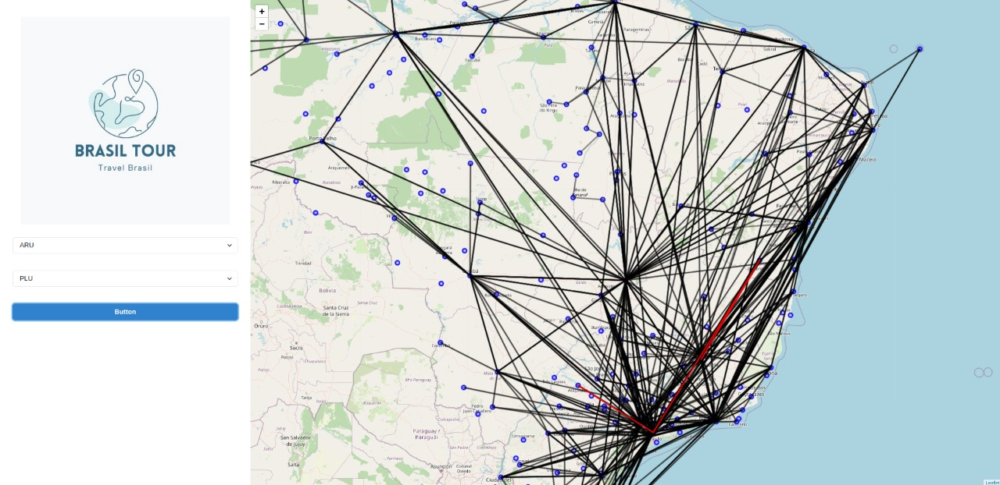

# Brasil Tour


**Número da Lista**: 30<br>
**Conteúdo da Disciplina**: Final<br>

## Alunos

|Matrícula | Aluno |
| -- | -- |
| 18/0127641  | Matheus Afonso de Souza |
| 18/0138545  | Thiago Mesquita Peres Nunes de Carvalho |

## Sobre

Utilize o Brasil Tour para descobrir de maneira performatica e extremamente divertida qual o caminho ideal para o seu destino. Além de descobrir qual o maior lucro que você pode ter transportando diversas cargas!

## Apresentação
A apresentação do projeto está presente no repositório.

## Screenshots



## Instalação

**Linguagem**: 

- Backend:
    - Python, utilizando FastAPI para setup do servidor e disponibilização dos endpoints HTTP.
    - Docker e Docker Compose para realiza conteinerização do ambiente de desenvolvimento e, assim, evitar erros relacionados a ambiente.
- Frontend:
    - Javascript, utilizando ReactJS como framework para montar a interface visual da aplicação.
    - Comunicação com o backend utilizando axios.
    - Disponibilização de mapa e linhas de viagem com Leaflet.

Para executar o projeto, você precisa ter o node.js, Docker e Docker Compose instalados. Caso já possua os pré-requisitos, utilize os seguintes comandos abaixo:

```jsx
# Para subir o backend
docker-compose up --build

# Para subir o frontend
npm install
npm start
```

## Uso

Para descobrir qual a rota da sua viagem, selecione nos dois inputs na página a origem e o destino da viagem, você pode encontrar o código do aeroporto clicando no círculo azul no mapa (irá abrir um popup com o código do aeroporto), você também pode definir um peso máximo de carga que o avião suporta e listar diversos items com peso e valor, assim sendo possível qual valor máximo de lucro considerando o peso limite de carga do avião.

Caso ocorra um erro, será apresentado um aviso de erro, caso contrário o caminho mais rápido irá aparecer em vermelho :)
